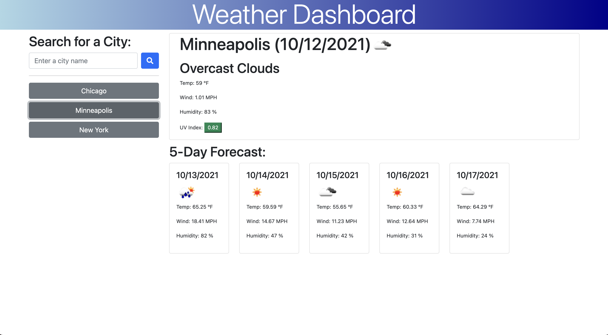

# weather-dashboard

This is an app to display the current weather and 5-day forecast for any city.

Here is the [link](https://seanscraig.github.io/weather-dashboard/) to the live webpage

# Instructions

1) Type in a city to search for.

2) Click the magnifying glass button to get the weather for that city

3) Click the name of previously searched cities to search for that city again

## Installation

Use git clone to clone the repository on your local machine and then open in a web browser.

## Contributing
Pull requests are welcome. For major changes, please open an issue first to discuss what you would like to change.